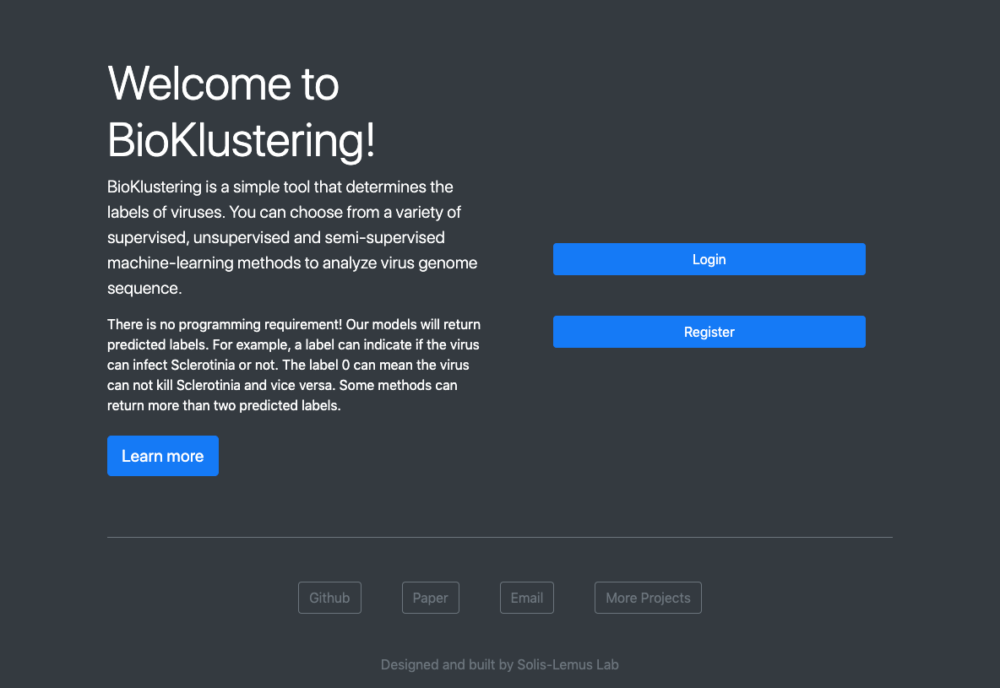
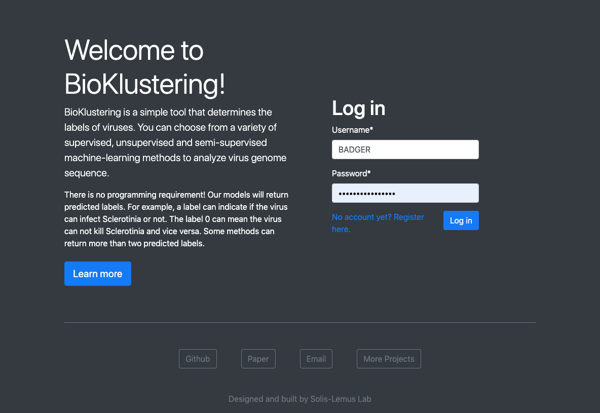
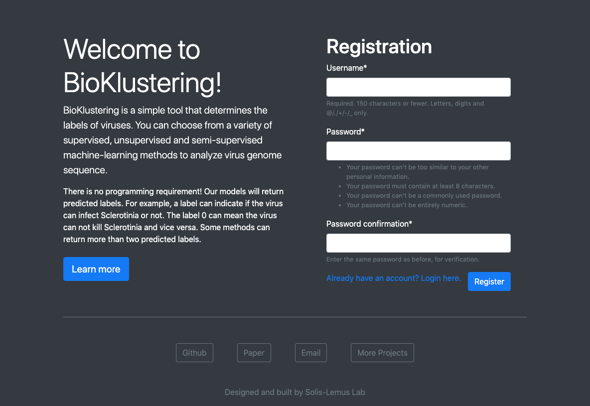
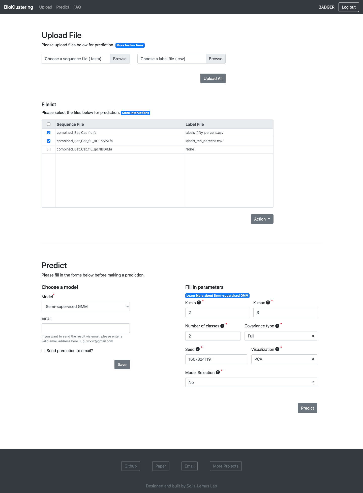
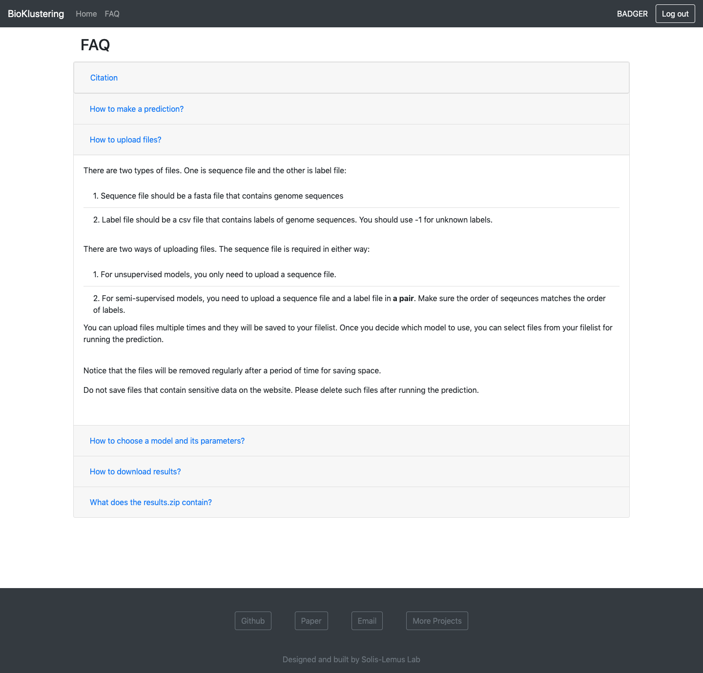
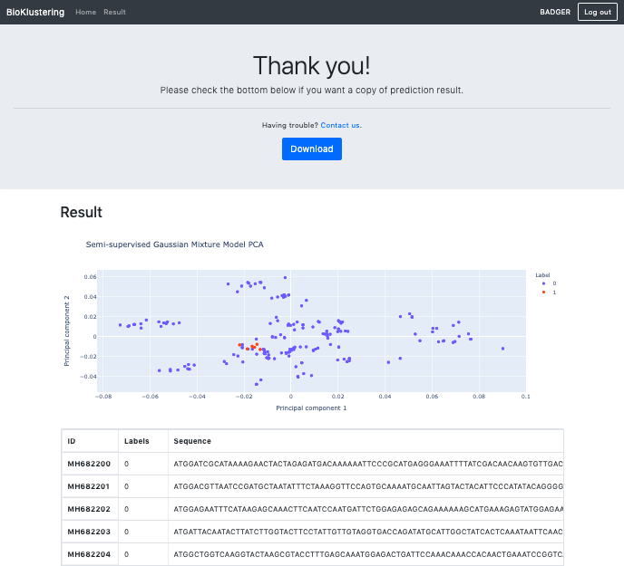

# BioKlustering Documentation
BioKlustering is a simple tool that determines the labels of viruses. Users can choose from a variety of supervised, unsupervised and semi-supervised machine-learning methods to analyze virus genome sequence.

The following shows the hirearchy of the wesite:
* Welcome Page
* Sign In / Sign Up Page
* Home Page
    * Upload
    * Predict
* FAQ
* Result Page

## Welcome Page
The welcome page contains the description of the website and links to sign in and sign up.

## Sign In Page
The sign in page where users log in their account

## Sign Up Page
The sign up page where users register a new account

## Home Page
The home page contains two sections. One is for uploading files and the other is for making prediction.

## FAQ Page
The FAQ Page

## Result Page
The result page contains an interactive plot built by plotly dashboard and a table with predicted labels. Users can download the results in a zip file which includes a static plot, a csv that containst the table and a txt that contains the parameter information.

